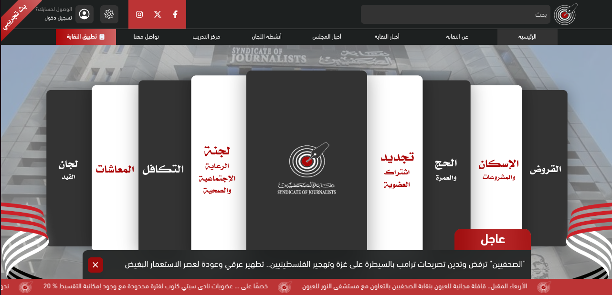

# 
 
  الموقع الرسمي لنقابة الصحفيين

The Official Website of the Journalists Syndicate

## Description
The official website of the Journalists Syndicate, providing comprehensive information and services for journalists in Egypt. The website aims to facilitate access to essential resources, online services, and the latest news related to the syndicate and its members.

## Features
- **Responsive Design**  
  Utilizes TailwindCSS for flexible and responsive layout design, ensuring a seamless user experience across all devices.

- **User Interface Components**  
  Material-UI (MUI) is used for pre-built, accessible components (e.g., buttons, cards, modals), enhancing UI consistency and speeding up development.  
  React Icons provides a wide variety of icons that integrate easily into the project for a polished look.

- **State Management**  
  Leverages Redux Toolkit and React-Redux for efficient global state management and data flow across components, ensuring a scalable architecture.

- **Routing**  
  React Router DOM enables smooth client-side routing, allowing for single-page application (SPA) behavior with easy navigation between pages.

- **Animations and Transitions**  
  Smooth animations are handled by Framer Motion, creating engaging and interactive UI transitions.  
  AOS (Animate On Scroll) provides scroll-based animations for dynamic content loading.

- **Dynamic Content Management**  
  Real-time content updates powered by Axios for seamless API communication, enabling dynamic loading of news, articles, and other resources.

- **User Authentication**  
  Implements secure user login with OTP (One-Time Password) authentication for enhanced security, providing a smooth authentication flow.

- **Search Functionality**  
  Quick and intuitive search feature for users to easily find relevant content within the site.

- **Cross-Browser Compatibility**  
  TailwindCSS along with Autoprefixer ensures consistent styling across different browsers, improving cross-browser compatibility.

- **Security and Data Sanitization**  
  DomPurify is used to sanitize user input and ensure secure handling of potentially dangerous HTML content.

- **Date and Time Handling**  
  Day.js is utilized for handling and formatting dates in a lightweight, performant manner.

- **Real-time Alerts and Notifications**  
  SweetAlert2 provides beautiful, customizable popups for user interactions like success/failure messages and form validations.

- **Developer Tools**  
  Vite is used for fast development builds, providing a quick feedback loop and optimized production builds.

## Skills
- **HTML5**
- **CSS3**
- **TailwindCSS**
- **Material-UI (MUI)**
- **JavaScript**
- **React.js**
- **Axios**
- **Redux, React-Redux**
- **React Router, React Router DOM**
- **Framer Motion**
- **SweetAlert2**
- **Day.js**
- **DomPurify**
- **React-Icons**
